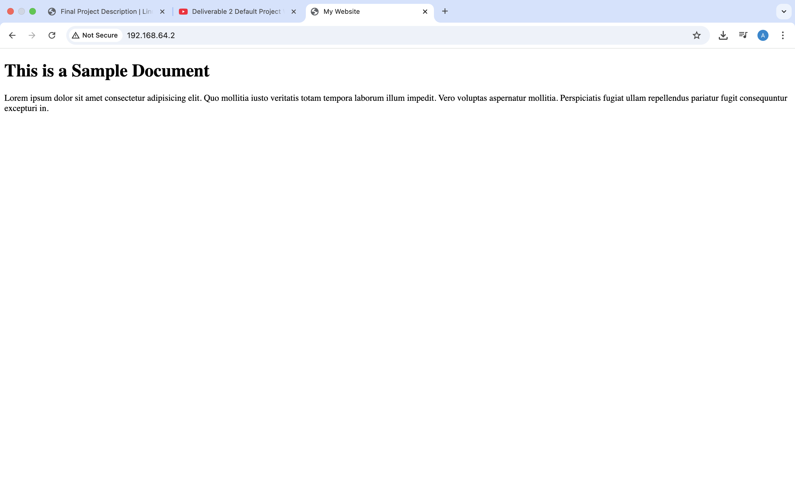
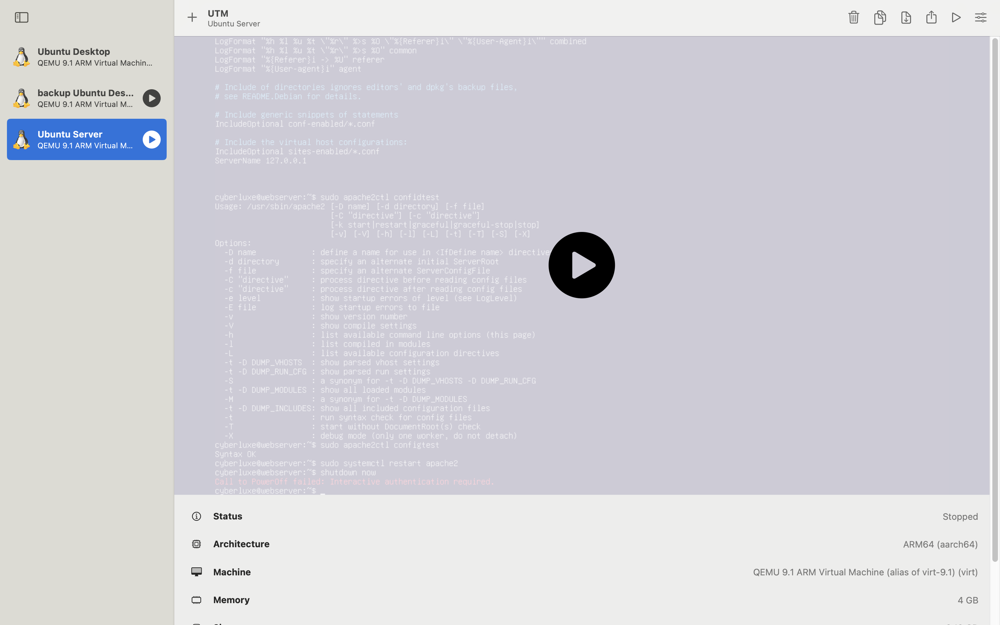
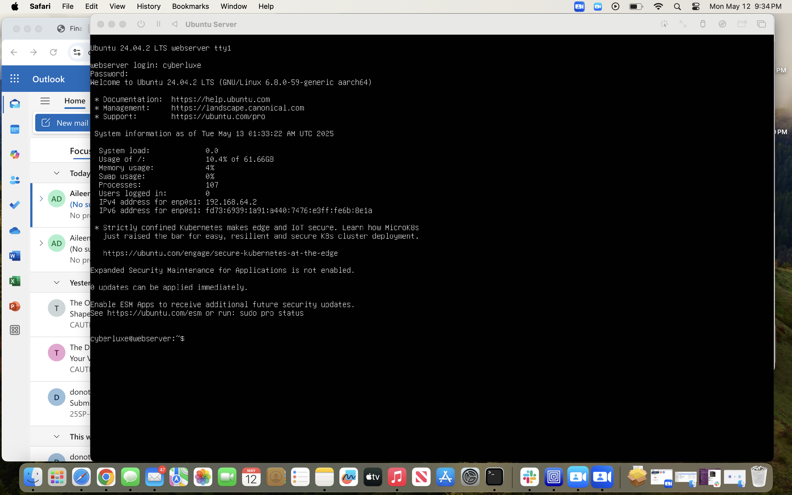

# Deliverable 2

1. What are the server hardware specifications (virtual machine settings)? Take a screenshot - don’t type it
   

2. What is Ubuntu server log in screen? Take screenshot - do not type it!
    

3. What is the IP address of your Ubuntu Server Virtual Machine?
   * `My IP address for my Ubuntu Server Virtual Machine is 192.168.64.2` 
4. How do you enable the Ubuntu Firewall?
    *`In order to enable the Ubuntu Firewall, you would need to use command `: `sudo ufw enable`

5. How do you check if the Ubuntu Firewall is running?
   * `We can check if the Ubuntu Firewall is running by using the command`: `sudo ufw status`
6. How do you disable the Ubuntu Firewall?
   * `sudo ufw disable`
7. How do you add Apache to the Firewall?
8. * `sudo ufw allow`
9.  What is the command you used to install Apache?
    * `sudo apt install apache2 -y`
10. What is the command you use to check if Apache is running?
    * `systemctl status apache2 --no-pager`
11.  What is the command you use to stop Apache?
    * `sudo systemctl stop apache2 --no-pager`
12. What is the command you use to restart Apache?
    * `sudo systemctl restart apache2 --no-pager`
13. What is the command used to test Apache configuration?
    * `sudo ufw allow 'Apache'`
14. What is the command used to check the installed version of Apache?
    * `sudo apt update; sudo apt upgrade -y`

