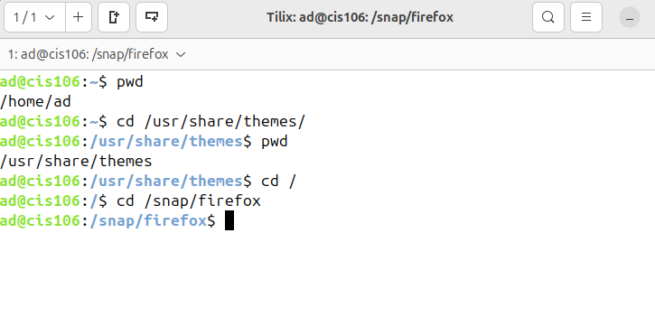
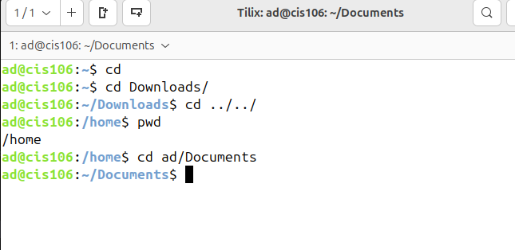
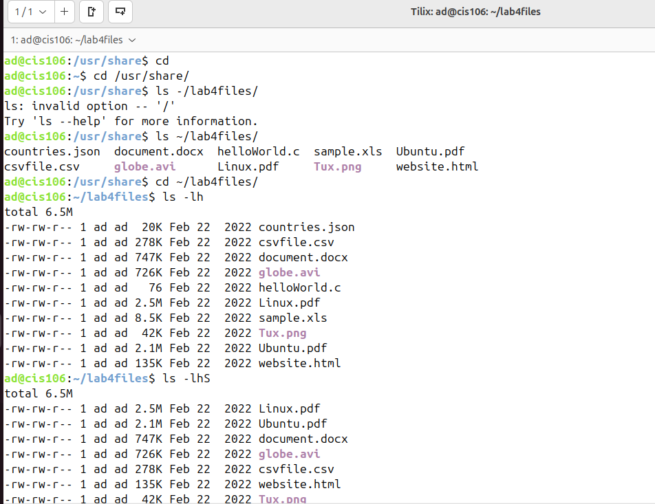
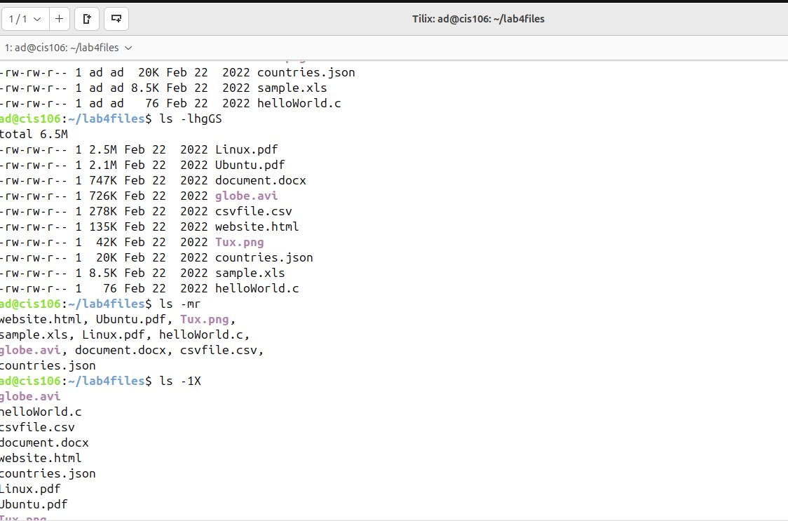
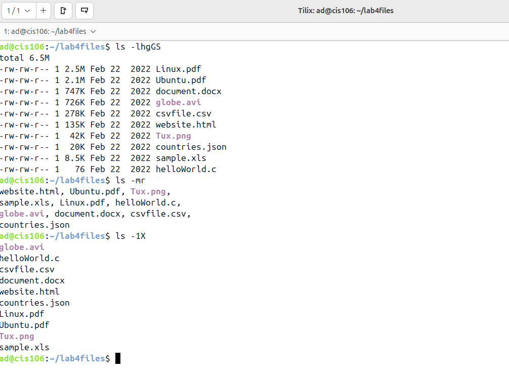
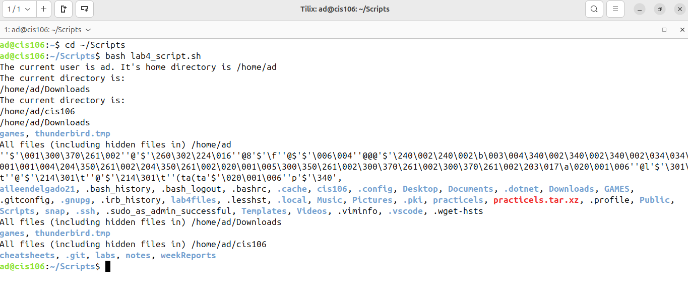
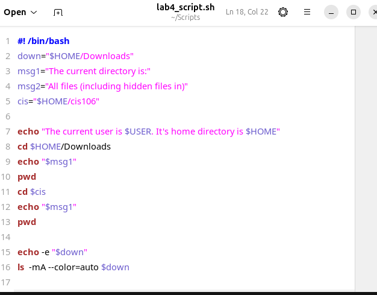
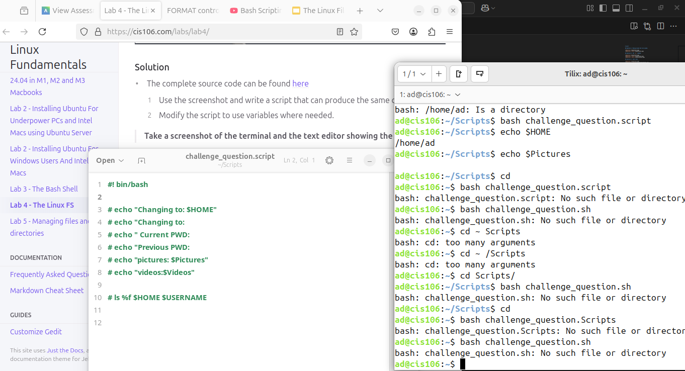

# Lab 4 

## Question 1: Moving around the file system.

## Question 2: The `ls` command.

## Question 3: Shell Bash.

## Question 4: Challenge-Write A Script.

* I was having trouble with this challenge question.
   

