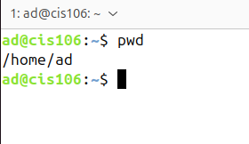

# Notes 4

## File system
**Definition**:
The way files are stored and organized.

**Usage/Formula**
* Linux uses the `hierarchical directory structure` (tree-like pattern of folders).
* Directory and folder mean the same thing. 
  
**Example(s)**
* First directory in the file system is called `the root directory`.
* Filesystem Hierarchy standard `(FHS)` specifies requirements and guidelines for file directory placement in UNIX-like operating systems.

## Pathname
**Definition**:
Indicates the location of the file in the filesystem (like an address).

**Usage/Formula**
* Absolute Path 
* Relative Path 
* 
**Example(s)**
* Absolute Path: ` /home/john/Downloads/song.mp3`
* Relative Path: `Downloads/song.mp3`

## Absolute path
**Definition**
The location of a file starting at the root of the file system.

**Example(s)**
` /home/john/Downloads/gong.mp3` 

## Relative path
**Definition**
The location of a file starting from the current working directory or a directory  that is located inside the current working directory.

**Example(s)**
` Downloads/song.mp3`

## The difference between YOUR home directory and THE home directory

* The difference between your home directory and the home directory is that your home directory is your user's personal directory where all your files are located.The home directory is the parent directory of all the home directories. This is where all the users' home directory are. 
  
**Example of "The home directory"**
* `/home`
**Example of "Your home directory"** 
  * `/home/maria53`

## Parent directory
**Definition**
Move forward to a subdirectory or backwards to the previous directory.
**Usage/Formula**
* `cd` is the command to change directories.
* `..`(two periods) represents the parent directory. 
  
**Example(s)**
* if your current directory is `/home/user/Documents/projects`, the parent directory is `/home/user/documents`

## Child directory or subdirectory
**Definition**
A better name for this is a subdirectory or subfolder. This is a directory inside another directory. 

## Bash special characters
**Definition**
Special characters are function like commands that tell the shell to perform specific action without having to type the complete command. These special characters make working on the command line more efficiently.
**Usage/Formula**
* `Single period= represents the current directory.`
* `2 consecutive periods=represents the parent directory.`
* `Tilde character= expands the current users home directory. `
**Example(s)**
* `. (single period)`
* `.. (2 consecutive periods)`
* `~ (tilde character)`

## Environment variables
**Definition**
Are used by the shell to track specific system information and user information. 
**Usage/Formula**
`env` `set` `printenv` 
**Example(s)**
`$USER` - will display the current user 
`$HOME`- stores the absolute path of the current's user home directory.
`$PWD` - stores the absolute path of the present working directory.
## User defined variables
**Definition**
Variables are defined using the assignment operator (=).

**Usage/Formula**
* `Variables names can contain letters, numbers, and underscores.`
* `They must start with a letter or an underscore.`
* `They cannot begin with a number`
* `No other special characters are allowed`
**Example(s)**
* `variable_name="value"`

## Why do we need use $ with variables in bash shell scripting?
* In bash scripting, the `"$"` symbol is crucial for accessing the value stored within a variable. Without it, you would only be referencing the variable's name as a literal string, not its contents. 

**Usage/Formula**
* When you assign a value to a variable in Bash, creating a name storage location in memory. 

## cd
**Definition** : Used for changing the current working directory. When no directory is given, cd changes the current working directory to the home directory of the current user.

**Usage/Formula**
`cd + destination`
`cd ~`
`cd -` -If you want to go to the previous current directory. 

**Example(s)**

## pwd
**Definition** : Used for displaying the current working directory.
**Usage/Formula**
`pwd`
**Example(s)**

## ls
used for displaying all the files inside a given directory. When no directory is specified, ls displays the files in the current working directory.
* `dir, tree and exa` are commands similar to ls

**Usage/Formula**
` ls + option + directory to list`
` man ls`

**Example(s)**
`ls`- List the content of the present working directory.
`ls -a`- List all the files inside the current working directory including hidden files.
` ls -a ~/Pictures` - List all the files inside a given directory.
` ls -lR ~/Pictures` - Long list all the files inside a given directory recursively. 
