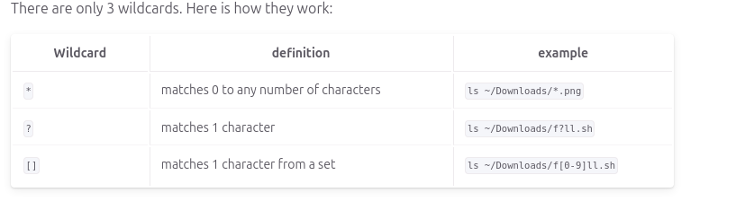

# Notes 6

## `*` (Star/Asterisk) Wildcard
* matches 0 to any number of characters. 
### Example(s): 
* List all the txt files:
 `ls *.txt`
* Move all the `.sh` (Shell Scripts) files:
`mv wildcard_extra_practice/*.sh wildcard_extra_practice/scripts/`
* List and then move all the image files in the wildcard_extra_practice directory. You will need to create a directory first.
` mkdir wildcard_extra_practice/images/`
` ls wildcard_extra_practice/img-*.*`
` mv -v wildcard_extra_practice/img-*.* wildcard_extra_practice/images/`

## `?` (Question Mark) Wildcard
* matches 1 character 
### Example(s):
* List all files that contain a 4 letter file extension:
`ls -1X wildcard_extra_practice/* .????`
* List all the files that contain a 4 letter file extension and start with a letter i:
`ls -1X wildcard_extra_practice/i* .????`

## `[]` (Square Brackets) Wildcard 
* matches 1 character from a set 
### Example(s):
* List all files that start with a capital letter: 
`ls wildcard_extra_practice/[A-Z]`
* List all the files that contain a number in their name:
` ls wildcard_extra_practice/*[0-9]*`
* List all the files that start with a capital letter and have a 2 character file extension:
` ls wildcard_extra_practice/[A-Z]* .??` 