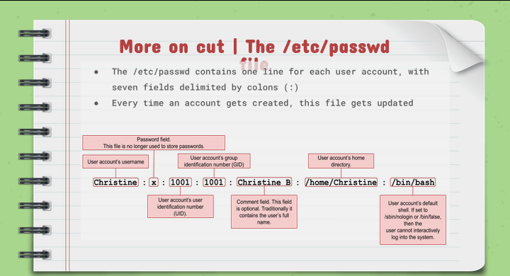
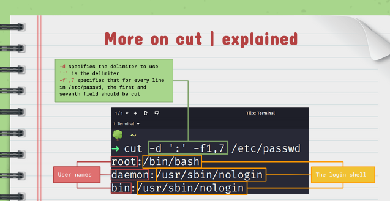

# Notes 7

## CAT

### Definition:
is used for displaying the content of a file.
### Usage/Formula: 
`cat + option + file(s) to display`
### Examples
* Display the content of a file located in the pwd : `cat todo.lst`
* Display the content of a file using absolute path : `cat ~/Documents/todo.lst`
* Display the content of a file line numbers: `cat -n ~/Documents/todo.md`
* Display the content of a file with line numbers excluding empty lines: `cat -b ~/Documents/todo.md`

## TAC

### Definition
 is used for displaying the content of a file in reverse order.   
### Usage/Formula
`tac + option + file(s) to display`
### Examples
* Display the content of a file located in the pwd: `tac todo.md`
* Display the content of a file using absolute path: `tac ~/Documents/todo.md`

## HEAD

### Definition
Displays the top `N` number of lines of a given file. By default, it prints the first 10 lines. If more than one file name is provided then data from each file is preceded by its file name.
### Usage/Formula
`head + option + file(s)`
### Examples
* Display the first 10 lines of a file: `head ~/Documents/Book/dracula.txt`
* Display the first 5 lines of a file: `head -5 ~/Documents/Book/dracula.txt`
* Display the first lines of multiple files:`head -n 5 dracula.txt bible.txt war-and-peace.txt`
* Display the first line of multiple files using wildcards:`head -n 1 *.csv *.py`

## TAIL

### Definition
Displays the last N number of lines of a given file. By default, it prints the last 10 lines. If more than one file name is provided then data from each file is preceded by its file name.   
### Usage/Formula
`tail + option + file`
### Examples
* Display the last 10 lines of a file: `tail ~/Documents/Book/dracula.txt`
* Display the last 5 lines of a file: `tail -5 ~/Documents/Book/dracula.txt`
* Display the last 5 lines of multiple files: `tail -n 5 dracula.txt bible.txt war-and-peace.txt`
* Display the last lines of multiple files using wildcards: `tail -n 1 *.csv *.py`

## CUT

### Definition
Is used to extract a specific section of each line of a file and display it to the screen.   
### Usage/Formula
`cut + option + file(s)`
### Examples
* Display a list of all the users in your system:`cut -d ':' -f1 /etc/passwd`
* Display a list of all the users in your system with their login shell:`cut -d ':' -f1,7 /etc/passwd`
* Cut a range of bytes per line:`cut -b 1-5 usernames.txt`

## SORT

### Definition
 Is used for sorting files. The sort command supports sorting: alphabetically. in reverse order, and by month. The sort command follows this order unless specified otherwise: 
* Lines starting with a number will appear before lines starting with a letter.
* Lines starting with a letter that appear earlier in the alphabet will appear before lines starting with appears later in the alphabet.
* Lines starting with a lowercase letter will appear before lines starting with the same letter in uppercase.    
### Usage/Formula
`sort + option + file`
### Examples
* Sort + option + file:`sort users.lst`
* Sort a file and save the output to a new file:`sort -o sorted.lst user.lst`
* Sort a file in reverse order:`sort -r users.txt`
* Sort by column number:`sort -k 2 users.txt`
* Sort a file with numeric data:`sort -n phones.txt`
** NOTE: USE THE -t OPTION TO SPECIFY A DELIMITER. FOR EXAMPLE: `sort -t";" -k3 cereal.csv`

## WC

### Definition
 Is used for printing the number of lines,characters and bytes in a file.   
### Usage/Formula
`wc + option + files(s)`
### Examples
* Display the number of characters in a file:`wc -m users.txt`
* Display the number of lines in a file:`wc -l users.txt`
* Display the number words in a file:`wc -w user.txt`

## TR

### Definition
 Is used for translating or deleting characters from standard output.   
### Usage/Formula
`Standard output | tr + option + set + set
### Examples
* Translate one character to another (for example a period with a comma.):`cat file.txt | tr '.' '.'`
* Translate white space into tabs:`cat program.py | tr "[!space:]" '\t'`
* Translate tabs into space:`cat file.py | tr -s "[!space:]" ' '`
  
## DIFF

### Definition
The diff command compares files and displays the differences between them. 
### Usage/Formula
`diff + option + file1 + file2`
### Examples
* Display the difference between two files:`diff cars.csv cars-backup.csv`
* Display the difference between two files in a column format:`diff -y cars.csv car-backup.csv`

## GREP

### Definition
Is used to search text in given files. Grep works line by line basis (it matches the search criteria in a line by line basis)   
### Usage/Formula
`grep + option + search criteria + files(s)` 
### Examples
* Search any line that contains the word "dracula" in the given file: `grep 'dracula' ~/Documents/dracula.txt` 
* Search any line that contains the word 'dracula regardless of the case:`grep -in 'dracula' ~/Documents/Books/dracula.txt` 
* Search for all the lines that do not contain the word 'war':`grep -v 'war' ~/Documents/Book/dracula.txt`
