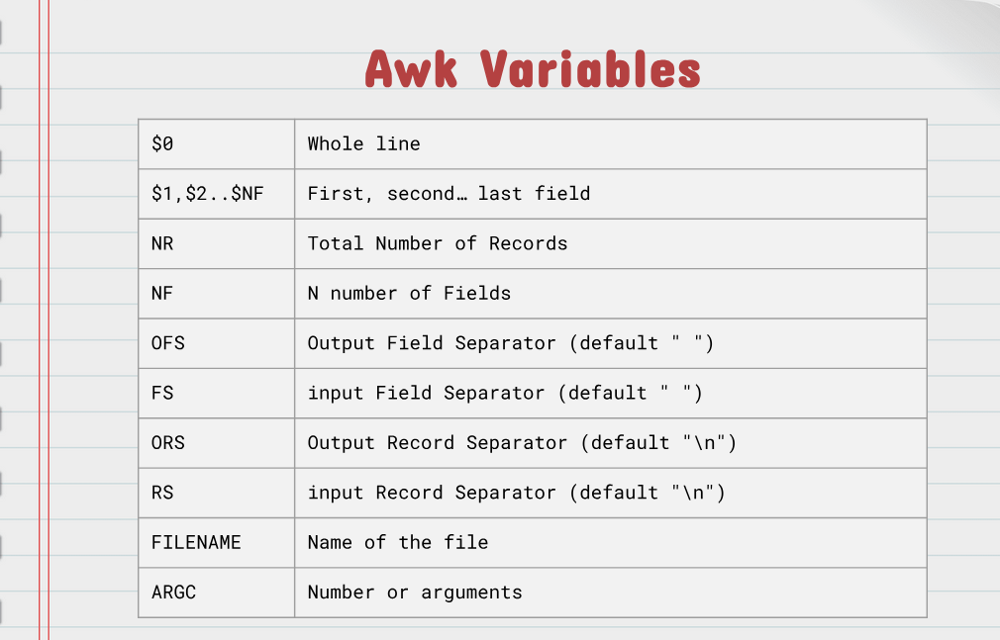
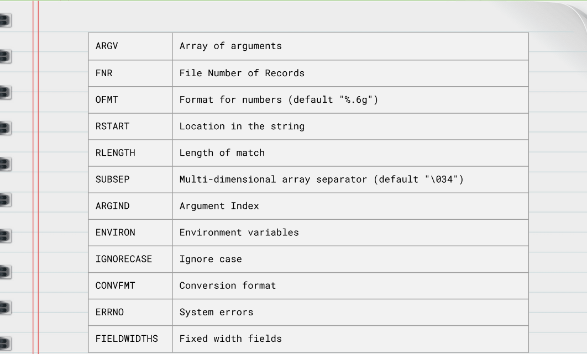

# Notes 8

## awk

### Definition
Is a scripting language used for processing and displaying text. `Awk` can work with a text file or from standard output. `Awk` was created in Bell Labs during the 70s by Alfred Aho, Peter Weinberger, and Brian Kernighan and its name comes from its authors' initials. There are several implementation of `Awk`: `nawk, mawk, gawk, and busybox` * `Awk` performs operations line by line* 
### Usage/Formula
`awk + options + {awk command} + file + file to save (optional)`
### Examples
* Print the first column of every line of a file: `awk '{print $1}' ~/Documents/Csv/car.csv`
* Print first field of /etc/passwd file:` awk -F: '{print $1}' /etc/passwd`
* Print the last field of the /etc/passwd file:`awk -F: '{print $NF}' /etc/passwd`
* Print the first and last field of the /etc/passwd:`awk -F '{print $1, " = " ,$NF}' .etc.passwd`

## sed

### Definition
Is a stream editor that performs operations on files and standard output. For instance it can search, find replace, insert, and deletion. By using SED you can edit files without opening them.
### Usage/Formula
`sed options + sed script + file`
### Examples
* Replacing a string in given file (replace pizza for rice): `sed 's/pizza/rice/' shopping-list.lst`
* Replacing only the fourth occurrence per line in a file:`sed 's/pizza/rice/4' shopping-list.lst`
* Replacing all the occurrence of the pattern in a file:`sed 's/pizza/rice/g' shopping-list.lst`
  
## less

### Definition
Is a Linux terminal pager that shows a file's contents one screen at a time.
### Usage/Formula
`less + options + file_path`
### Examples
* Load a text file into `less` by specifying the file path: `less /etc/updatedb.conf`
* Display specified text file with line numbers:`less -N /etc/init/mysql.conf`

## `>`- 

## `>>` - adds to a file

## `|`

### Definition
The pipe allows you to redirect the standard output of a command to the standard input of another.
### Usage/Formula
`command_1 | command_2 | command_3 |... | command_N`
### Examples
* Use `grep` to look for a string in a particular man page:`man ls | grep "human-readable"`
* Display only the options of any command from its man page:`man ls | grep "^[[:space:]]* [[:punct:]]"`
